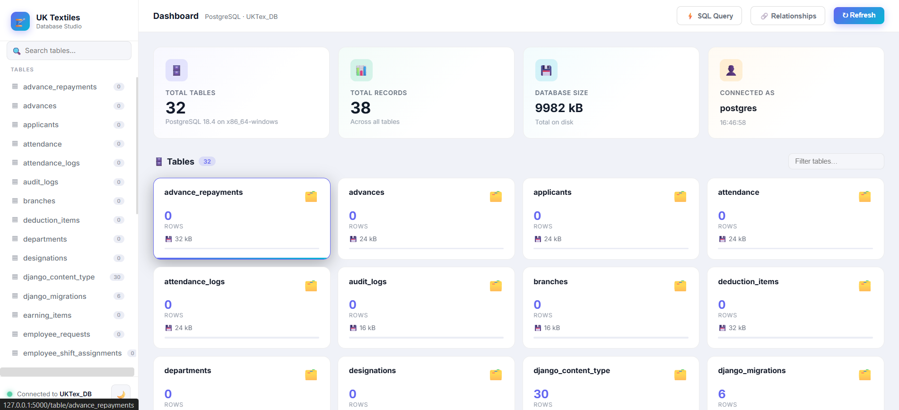
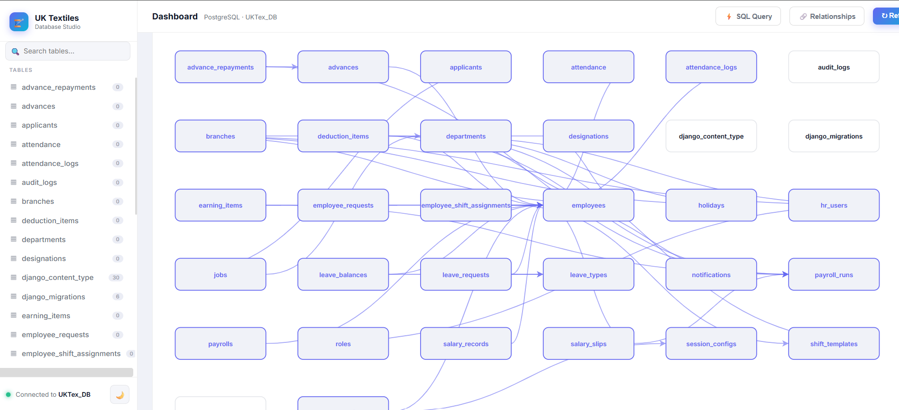
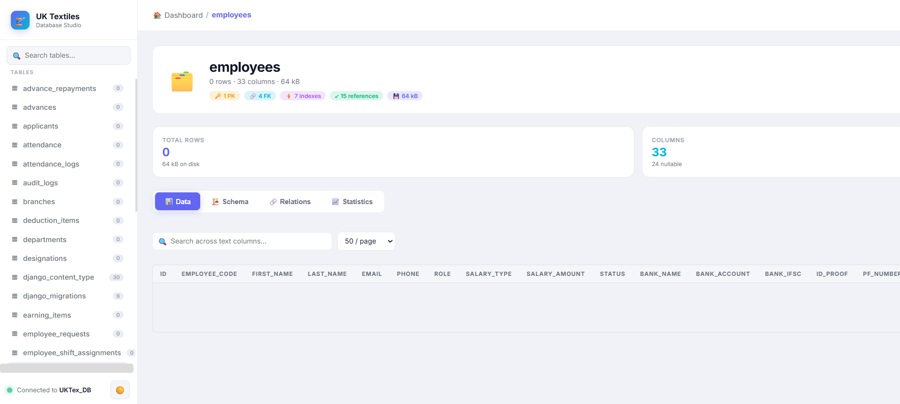

# 🧵 UK Textiles — Database Studio

A modern, enterprise-grade PostgreSQL database management dashboard built for the UK Textiles internal database. Designed to give a clean, interactive window into live database tables, schemas, and data — without needing pgAdmin or any desktop client.

---

## What It Does

This is a web-based database viewer that connects directly to the UK Textiles PostgreSQL database and presents it through a polished, professional UI. It runs as a lightweight Flask server and is accessible from any browser.

### Dashboard Overview
The home screen loads a live summary of the entire database — total tables, total records across all tables, database size on disk, and the connected user. Each table is shown as a card with its row count and relative size visualised as a bar.

## Live App

Deployed at: `https://ukt-db-viewer.onrender.com` *(update with your Render URL)*

---

*Built for UK Textiles internal use.*
